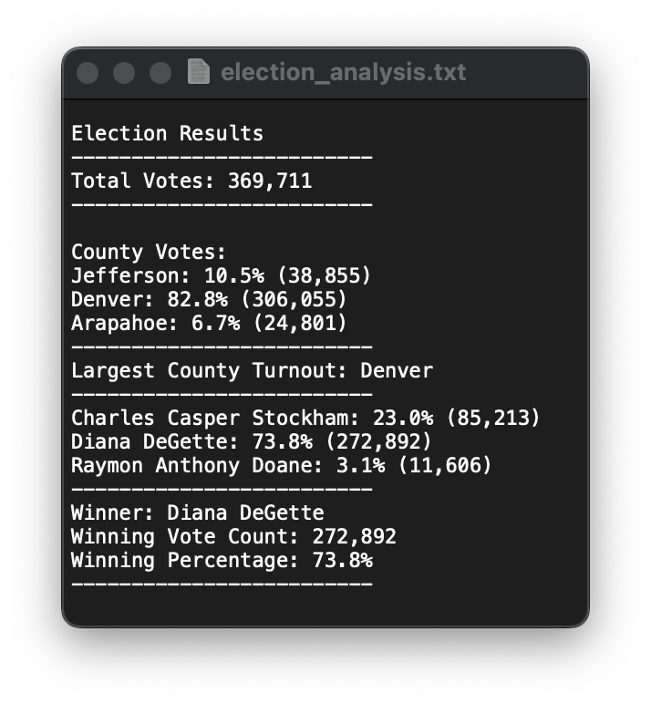

# Election-Analysis
## Overview of Project
### Purpose
The purpose of this election audit analysis project was to add data requested by the election commission. The election commission requested additional data to complete their audit: the voter turnout for each county, the percentage of votes from each county out of the total count, and the county with the highest turnout.

### Background
The CSV provided had 3 columns: Ballot ID, County, and Candidate. To obtain the data required by the election commission the following data needs to be collected and calculated:

1. Calculate the total number of votes cast.
2. Get a complete list of candidates who received votes.
3. Calculate the total number of votes each candidate received.
4. Calculate the percentage of votes each candidate won.
5. Calculate voter turnout for each county.
6. Calculate percentage of votes from each county.
7. Calculate the county with the highest turnout.
8. Determine the winner of the election based on popular vote.

The election results CSV is located in the Resources folder.

## Analysis
1.  The total number of votes cast was 369,711.
2.  The complete list of candidates who received votes:
    * Charles Casper Stockham
    * Diana DeGette
    * Raymon Anthony Doane.
4.  The total number of votes 
    * Charles Casper Stockham was 85,213. 
    * Diana DeGette was 272,892. 
    * Raymon Anthony Doane was 11,606.
5.  The total vote percentage
    * Charles Casper Stockham was 23.0%. 
    * Diana DeGette was 73.8%. 
    * Raymon Anthony Doane was 3.1%.
6.  The voter turnout
    * Jefferson County was 38,855.
    * Denver County was 306,055.
    * Arapahoe County was 24,801.
7.  The voter percentage
    * Jefferson County was 10.5%.
    * Denver County was 82.8%.
    * Arapahoe County was 6.7%.
8.  The county with the highest voter turnout was Denver County.
9.  The winner of the election based on popular vote was Dianne DeGette. 

## Election Audit Results

The results above are a snippet of the text file created in the code. This shows all relevant information detailed in the analysis. 

## Election Audit Summary
The Election Audit Analysis Project can be modified to be used in future election analysis by updating the following:
1. The CSV file of the election results and updating the file path.
`file_to_load = os.path.join("Election-Analysis","Resources", "election_results.csv")`
2. The descriptions and titles for election specific items, such as changing counties to states.

`# County Options List
county_options = []
# County Votes Dictionary
county_votes = {}

#Track the highest turnout per county and percentage
highest_turnout_county = ""
highest_votes_county = 0
votes_per_county = 0`

These are just examples of what can be used. An easy way to do this would be by Control Find & Replacing the word "County" with the word "State."
